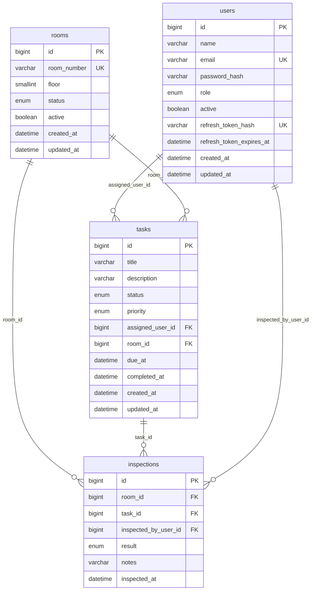
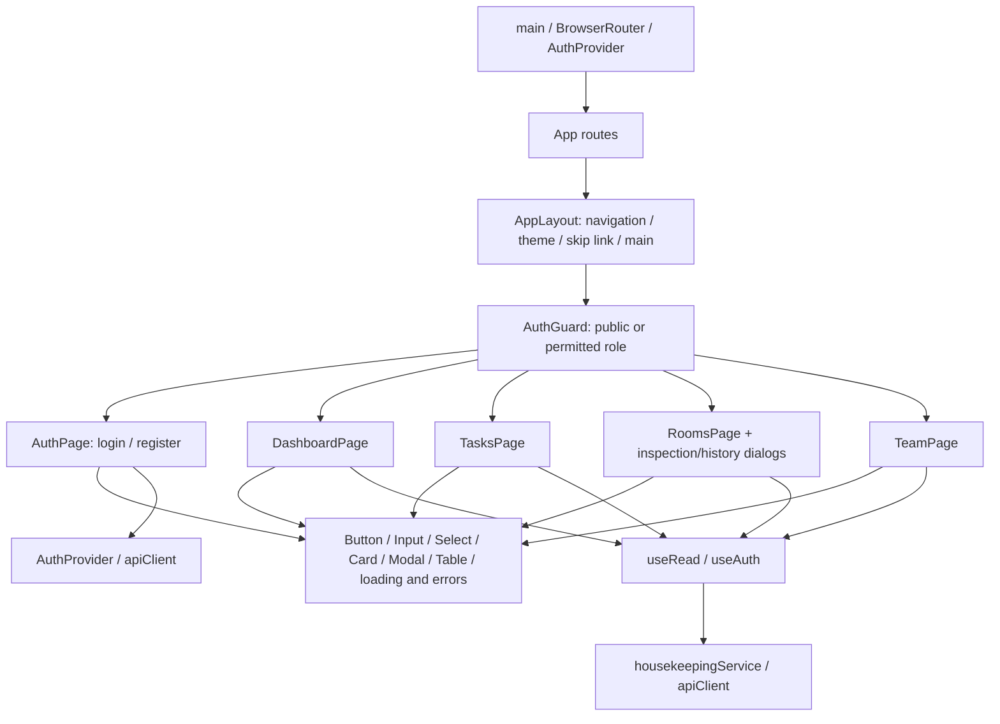

# Rockey housekeeping capstone submission draft

Status: current product/implementation documentation, **not a claim that final submission is complete**. Prepared 2026-10-08 on the uncommitted `refactor/final-capstone-polish` working tree based on `2ccc706b2ee7f93efd395d60b00a009057a30dbd`.

The supplied official capstone PDF and `00_CAPSTONE_REQUIREMENTS.md` remain grading sources; they live outside this repository. Instructor-confirmed AWS waiver is recorded below. No other waiver is inferred. Earlier CAPSTONE documents 10–20 describe the superseded hotel-wide product, not a requirement to restore removed domains.

## Problem, solution and users

Housekeeping staff need to know which room to clean, who owns that work and whether a supervisor has checked the result. A room should not appear ready just because someone changed a label. Rockey connects assigned cleaning work, controlled room transitions and retained inspection history in one role-aware interface.

- **USER / Housekeeper:** views and executes only their assigned cleaning tasks.
- **MANAGER:** manages rooms/assignments and records inspections, but does not execute housekeeper tasks.
- **ADMIN:** has supervisor capabilities plus non-ADMIN account administration.

This is an internal housekeeping application, not a guest booking/payment system. Public registration creates USER only; supervisors still decide assignments. The first ADMIN is created through the private local setup procedure, not a public privileged endpoint.

## Approved scope and boundaries

Exactly four entities/tables: User/users, Room/rooms, Task/tasks, Inspection/inspections. Backend roles are USER/MANAGER/ADMIN; Housekeeper is a UI label for USER.

Workflow: DIRTY room -> assigned Task -> USER starts -> CLEANING -> USER completes -> INSPECTION -> supervisor records PASS (READY) or FAIL (DIRTY/rework). Cancellation/deactivation preserves rows/history.

No Department, Employee, Event/Registration, Inventory, Alert or separate Analytics domain. No reservation, revenue, forecasting, AI/voice, generic workflow engine or inspection analytics. No new table, dependency or API operation is introduced by the quality polish.

## User stories and acceptance criteria

These HK identifiers document existing housekeeping behavior; they do not silently reuse the old hotel-wide US/FR identifiers. Fifteen stories exceed the official eight-story minimum and ten-story Excellent target without adding business features.

| ID | Story | Acceptance criteria |
|---|---|---|
| HK-US-01 | As a housekeeper, I want to register an account. | Valid unique email/name/password creates USER only; invalid input is rejected and privileged role escalation is unavailable. |
| HK-US-02 | As an active user, I want to sign in securely. | Valid credentials establish authenticated identity; invalid/inactive credentials fail safely; auth rate limits remain enforced. |
| HK-US-03 | As a signed-in user, I want session recovery and sign-out. | Expired access can refresh once through HttpOnly cookie; logout revokes refresh and expires cookie; no browser token persistence. |
| HK-US-04 | As a housekeeper, I want to see only my work. | Task lists/details are ownership-scoped; another user's task is rejected by backend, not merely hidden in UI. |
| HK-US-05 | As the assigned housekeeper, I want to start cleaning. | Only own ASSIGNED work can become IN_PROGRESS; room becomes CLEANING in the same transaction; supervisors cannot execute it. |
| HK-US-06 | As the assigned housekeeper, I want to complete cleaning. | Only own IN_PROGRESS work can complete; server sets completion time and room becomes INSPECTION atomically. |
| HK-US-07 | As a supervisor, I want to manage room availability. | Valid unique rooms can be created/edited; number remains immutable; readiness cannot bypass inspection; active work/pending inspection blocks deactivation. |
| HK-US-08 | As a supervisor, I want to assign cleaning work. | Creation requires an active USER and active DIRTY room; competing non-terminal work for the room is rejected. |
| HK-US-09 | As a supervisor, I want to change or cancel unfinished work. | Non-terminal work can be edited/reassigned/cancelled; room cannot change; completed history cannot be edited/cancelled; cancellation retains history. |
| HK-US-10 | As a supervisor, I want to record a room inspection. | Latest completed task must belong to the active INSPECTION room; authenticated supervisor is recorded; PASS makes READY and FAIL makes DIRTY. |
| HK-US-11 | As a supervisor, I want retained inspection history. | Authorized history lists show result/task/inspector/notes/time; no inspection edit/delete operation exists; earlier cycles remain readable. |
| HK-US-12 | As a manager, I want to provision and view housekeepers. | Manager list/detail scope is USER only; creation cannot grant MANAGER/ADMIN; manager cannot update/deactivate accounts. |
| HK-US-13 | As an admin, I want to oversee non-ADMIN accounts. | ADMIN can provision USER/MANAGER and update/deactivate non-ADMIN accounts; active work blocks eligibility changes; ADMIN accounts stay bootstrap-managed. |
| HK-US-14 | As a user, I want a relevant housekeeping overview. | USER counts only own tasks; supervisors also see authorized active room counts; current complete lists are used, never a single page extrapolated into totals. |
| HK-US-15 | As a keyboard user, I want clear, recoverable forms and navigation. | Fields associate safe errors and retain drafts; pending/uncertain writes are guarded; route navigation focuses main; modal/skip/theme behavior stays accessible. |

## Functional requirements and implementation evidence

Sixteen current functional requirements exceed the official minimum of ten. Test references are source evidence; actual execution/coverage is recorded only in [SECURITY_AND_QUALITY.md](SECURITY_AND_QUALITY.md#current-verification--2026-10-08).

| ID | Requirement | Stories | Implementation / test evidence |
|---|---|---|---|
| HK-FR-01 | Register validated unique USER accounts only. | 01 | AuthController/AuthService; AuthServiceTest, authUi/apiClient tests |
| HK-FR-02 | Authenticate active accounts with BCrypt/JWT and bounded attempts. | 02 | AuthService, JwtService, AuthenticationRateLimiter; auth/security tests |
| HK-FR-03 | Rotate/revoke one hash-only refresh session and expose safe own profile. | 03 | AuthService/AuthController; API client/session regression tests |
| HK-FR-04 | Enforce current role/active status and task ownership server-side. | 04–13 | JWT filter, UserService, TaskService; MVC/security/service tests |
| HK-FR-05 | Create/read/edit/soft-deactivate rooms with validated lifecycle. | 07 | RoomController/RoomService; RoomServiceTest; rooms UI tests |
| HK-FR-06 | Create assigned cleaning work with valid active references. | 08 | TaskService/create, repository row locks; TaskServiceTest |
| HK-FR-07 | Start own ASSIGNED task and transition its room atomically. | 05 | TaskService/status; service/MVC and housekeeper UI tests |
| HK-FR-08 | Complete own IN_PROGRESS task and stamp completion atomically. | 06 | TaskService/status; service/MVC and housekeeper UI tests |
| HK-FR-09 | Allow supervisor non-terminal editing/reassignment/cancellation only. | 09 | TaskService/update/cancel; task management/security tests |
| HK-FR-10 | Record minimal authenticated PASS/FAIL inspections transactionally. | 10 | RoomService/inspect, RoomDtos; RoomServiceTest, inspection UI tests |
| HK-FR-11 | Retain soft-lifecycle and append-only inspection history. | 09,11,13 | Entity/FK schema and services; history/guard tests |
| HK-FR-12 | Provide scoped team provisioning and non-ADMIN administration. | 12,13 | UserService/UserController; team/service/security tests |
| HK-FR-13 | Derive only approved housekeeping dashboard counts from authorized data. | 14 | DashboardPage, scoped task/room APIs; dashboard isolation/zero-count tests |
| HK-FR-14 | Return safe DTO/errors and associate allowlisted form validation errors. | 01,07–13,15 | GlobalExceptionHandler, DTOs, apiClient, Input/Select, business pages; form/error tests |
| HK-FR-15 | Provide six protected/public routes, reusable controls and role-aware UI. | All | App/AuthGuard/AppLayout, shared UI; route/auth/theme/component tests |
| HK-FR-16 | Reject uncertain duplicate submissions until explicit read reconciliation and malformed essential responses before rendering. | 15 | Local page refs/state, housekeepingService; write/reconciliation/response tests |

Names above are grouping references. The actual production/test files are under [src/main/java](../src/main/java), [src/test/java](../src/test/java) and [frontend/src/tests](../frontend/src/tests). No claim is made that every named requirement has fresh live-MySQL/browser verification in this pass.

## Non-functional requirements

| Area | Current requirement / evidence boundary |
|---|---|
| Security | Backend RBAC/ownership, BCrypt, JWT validation, single hash-only refresh, Origin/CORS controls and safe DTOs; memory-only access JWT/HttpOnly refresh. No default credentials in repo. |
| Integrity | Required FKs, unique email/room number, floor/completion constraints, explicit indexes; service checks enforce active references and task/room consistency. |
| Reliability | Task/room and inspection/room mutations share transactions; conditional lock order User -> Room -> Task; active-work checks use locking current reads. Mock tests are not proof of database races; fresh live races remain NOT RUN. |
| Accessibility | Labeled controls, safe field associations, skip/main focus, keyboard modal behavior, non-color status text and reduced motion. Native-browser/responsive validation of this polish is PENDING. |
| Maintainability | Controller -> Service -> Repository -> Entity, DTO boundary, constructor injection, checked JS and small local state. No generic mutation/workflow framework or new dependency. |
| Time | Authentication uses UTC Instant; operational offset-free LocalDateTime uses JVM America/New_York per local setup. UI must not relabel those values as UTC. |
| Quality | Maven production line gate >=70%, Excellent target >=80%; success/failure/security cases. Use canonical measured results, not historical totals as fresh evidence. |
| Scalability | Pagination is a documented capstone phase task but currently blocked awaiting waiver/approved contract. Do not claim it is implemented. |
| Performance | No current benchmark/SLA evidence: PENDING measurement/accepted target. Do not invent response-time claims. |
| Reproducibility | Fresh four-table schema, private first-ADMIN procedure and pinned project runtimes documented. Old nine-table data is incompatible, not automatically migrated/reset. |

## Logical system architecture

This shows the actual logical local stack, not an assertion that hosting/deployment exists.

```mermaid
flowchart LR
    Browser[Housekeeper / Manager / Admin browser] --> UI[React + Vite / React Router]
    UI --> Client[API adapter / memory-only access JWT]
    Client -->|JSON + Bearer / credentialed refresh cookie| Security[Spring Security / JWT / Origin and CORS checks]
    Security --> Controllers[Auth / User / Room / Task controllers]
    Controllers --> Services[Auth / User / Room / Task services]
    Services -->|transactions and ordered locks| Repositories[Spring Data JPA repositories]
    Repositories --> Entities[User / Room / Task / Inspection]
    Entities --> DB[(MySQL: four tables)]
    Controllers -->|safe DTO or error| Client
```

Authorization belongs to the backend, not hidden UI buttons. Inspector identity comes from authenticated principal, not a request body. Minimal inspection behavior belongs to RoomController/RoomService; no extra domain layer is invented.

## Four-table ERD

Derived from [database/schema.sql](../database/schema.sql), not the old wireframe. Each child FK is required; each parent can have zero or more related rows. Attribute constraints and nullable fields are stated below.

- All IDs: auto-increment BIGINT primary keys. All five FKs are NOT NULL; there are no destructive cascade declarations.
- Users: name(100), unique email(120), password_hash(60), role USER/MANAGER/ADMIN, active; nullable unique refresh_token_hash(64) and nullable refresh_token_expires_at. No credential values are documented.
- Rooms: unique immutable room_number(10), floor CHECK 1–99, active; statuses READY/DIRTY/CLEANING/INSPECTION/OUT_OF_SERVICE.
- Tasks: title(150), nullable description(1000), statuses ASSIGNED/IN_PROGRESS/COMPLETED/CANCELLED, priorities LOW/MEDIUM/HIGH/URGENT; nullable due_at/completed_at. Completion CHECK requires completed_at exactly when status is COMPLETED. Indexes `(assigned_user_id,status)` and `(room_id,status)`.
- Inspections: result PASS/FAIL, nullable notes(1000), inspected_at; index `(room_id,inspected_at)`. No UNIQUE task_id is claimed: room locking/workflow eligibility prevents repeat recording for that completed cycle in application behavior.
- Timestamps use DATETIME(6); all other shown columns are NOT NULL. Task.room and Inspection.room consistency is checked by service. Inspector references a supervising User; task assignee eligibility is active USER.

## React component diagram

Hooks have specific uses: useState for local UI/errors; useEffect for reads/route effects; useContext through useAuth; useReducer for task draft; useMemo for dashboard counts; useCallback for cancellable loaders; useRef for focus/submission guards. New resilience uses local page logic, not a general mutation engine.

## API pointers and freeze

[OpenAPI snapshot](rockey-openapi.json), [24-operation table and DTO/error guide](BACKEND_GUIDE.md#api--24-operations), [Postman collection](../postman/Rockey-Housekeeping.postman_collection.json).

Auth: register/login/refresh/me/logout. Users: list/create/detail/update/deactivate. Rooms: list/create/detail/update/deactivate/status, history/list and inspection/create. Tasks: list/create/detail/update/cancel/status. Lists remain complete arrays; no unapproved page wrappers/filters/count endpoint are added.

Six UI routes: /login, /register, /dashboard, /tasks, /rooms, /team; unknown routes show Page not found. Rooms/Team are supervisor-only; task ownership is enforced server-side. All four core tables and twenty-four operations remain unchanged.

## Architecture decisions

| Decision | Rationale / boundary |
|---|---|
| Four housekeeping domains only | Matches approved scope and four-table ERD target; do not restore deleted hotel-wide features to satisfy old planning documents. |
| USER means Housekeeper; MANAGER/ADMIN oversee | Preserves rubric USER/ADMIN names; only assigned USER executes tasks, supervisors inspect/manage. |
| Unidirectional `@ManyToOne`, no reverse collections/cascades | Queries load the required child/parent relationships; unused `@OneToMany` collections and unrelated `@ManyToMany` add no current use case. No REMOVE cascade/orphan removal protects retained history. This is a deliberate mapping choice to justify, not an assertion that every annotation example is implemented. |
| Transactional service workflows and ordered row locks | Prevent partial task/room/inspection changes and conflicting active-work decisions; preserve current implementation rather than replace it. |
| Inspection stays minimal inside Room service/controller | It is append-only history with PASS/FAIL, not a separate workflow engine. |
| Memory JWT / HttpOnly refresh / one server refresh session | Limits browser token persistence; single-session behavior means tabs/devices can invalidate earlier refresh state. No client contract is changed to hide this limitation. |
| Checked JavaScript and ordinary React hooks | Course-aligned readable components; no TypeScript rewrite, schema library or generic mutation framework. |
| Fixed safe field messages / dependency-free response checks | Prevent arbitrary server internals entering UI and reject malformed consumed shapes without duplicating business validation. |
| Read reconciliation after uncertain write | A lost response may follow a committed mutation. No network/5xx replay; blocked writes require a successful explicit read, while existing legitimate 401 recovery remains. |
| Keep array contract while pagination is unresolved | Both audits require clarification; this document does not waive the phase task or authorize contract changes. |
| AWS waiver only | Instructor waived AWS due insufficient training; CI/CD, deployment, accessible URL and branch protection are not automatically waived. |

## Requirement/evidence matrix and unresolved gates

| Official expectation | Evidence / current status |
|---|---|
| 8+ stories, Excellent 10+; 10+ FRs; NFRs | Current sections above: 15 stories and 16 FRs, with acceptance/implementation mapping. Instructor grading is not claimed. |
| Architecture, ERD, component diagram, API design | Current logical diagrams/full schema attributes above; linked OpenAPI and backend guide. Hosted-state diagram PENDING accepted deployment plan. |
| Four-table Excellent target | Four core tables, actual constraints/cardinality/indexes documented. Mapping/cascade rationale recorded; no speculative extra relationship added. |
| React/Vite, 5+ routes, reusable UI/hooks | Six routes, named reusable components and actual hook uses above; source/tests under frontend. |
| Java/MySQL/JPA/service/controller/validation/errors/JWT/RBAC/testing | Existing production implementation and tests; measured current offline evidence in canonical quality record. |
| >=70% coverage, >=80% Excellent target | See canonical measured run/scope; skipped live tests are not passes. |
| Postman operations | Current collection has all 24 operations; static audit and historical/live execution distinguished in quality record. |
| Pagination | **PENDING** instructor waiver or explicit response/filter/count contract approval; currently not implemented. |
| Test seed-data script | **PENDING** accepted form/implementation. SQL files are schema and private bootstrap template only; API fixtures are not claimed to be an approved standalone seed-script substitute. |
| Current Sonar requirement | **PENDING** authorization/environment and fresh analysis of housekeeping source; old nine-table dispositions are historical. |
| AWS services | **WAIVED — instructor confirmed**. No AWS implementation planned in this pass. |
| Non-AWS CI/CD | **PENDING** instructor decision; official phase tasks name CodePipeline, Excellent criteria name Jenkins. |
| Deployment/frontend + backend accessible URLs | **PENDING** accepted non-AWS approach and actual URLs; localhost is not a public deployment. |
| Branch protection | **PENDING** authorized policy/settings; audit found main unprotected. No GitHub setting changed. |
| Presentation slides/PDF, 5–10 minute delivery | **PENDING** actual artifacts; local demo/presentation outline below is a plan, not completed delivery. |
| Two peer reviews; feedback given/received/incorporated | **PENDING** genuine evidence; agent verification is not automatically two peer reviews. |
| Jira shared board, final story status, closed sprint | **PENDING** actual instructor-accessible evidence. |
| Self-assessment/Canvas submission/deadline | **PENDING** actual completion and current instructor deadline. |
| Demo credentials | **PENDING** private setup/delivery; never put credential values in this file. |

## Local demo plan (not executed in this polish pass)

Use [LOCAL_SETUP.md](LOCAL_SETUP.md), Java 17/MySQL 8 and a fresh explicitly selected four-table database. Any disposable fixture/reset/live test execution needs approval. Do not import over older or user data.

1. Prepare first ADMIN privately using the reviewed USER registration/bootstrap procedure; no hardcoded password or bootstrap API.
2. ADMIN provisions one MANAGER and two USER accounts through existing Team operations. Keep credentials private.
3. MANAGER creates DIRTY room and cleaning task assigned to USER A. USER B sees only their own work; approved denial checks confirm backend ownership.
4. USER A starts/completes the task: CLEANING then INSPECTION. Show that supervisors manage work but cannot execute it.
5. MANAGER records FAIL; room becomes DIRTY. Create a new cleaning cycle, have USER complete it, then record PASS -> READY. Show both history entries and authenticated inspector.
6. Show non-terminal reassignment/cancellation and active-work deactivation guards without deleting historical data.
7. Show safe field errors, keyboard navigation/modal focus, theme, and authorized dashboard counts. If demonstrating uncertainty, reconcile through reads rather than replay a write blindly.
8. Use the approved disposable Postman suite only after authorization. Never display tokens, passwords or hashes during the presentation.

Suggested nine-minute outline: problem/users (1), architecture/model/security (2), cleaning/inspection demo (3), transaction/ownership/resilience challenge (2), lessons and honest pending gates (1). Slides/PDF and actual delivery remain PENDING.

## Final submission checklist

- [ ] Instructor review of this current-scope requirements/diagram/decision package.
- [ ] Pagination waiver or approved implementation; accepted seed-data script form.
- [ ] Independent re-verification of the polish working tree and fresh authorized live/browser checks as required.
- [ ] Current housekeeping Sonar results reviewed; no historical certification substituted.
- [ ] Non-AWS CI/CD/deployment/access URL expectations clarified and evidenced.
- [ ] Branch-protection policy approved/configured; final reviewed code publication separately authorized.
- [ ] Genuine two-peer feedback given/received and incorporation evidence.
- [ ] Jira board shared; stories finalized and sprint closed with evidence.
- [ ] Presentation slides/PDF and 5–10 minute demo rehearsed/delivered.
- [ ] Private demo credentials delivered through an approved channel.
- [ ] Self-assessment and all required Canvas artifacts submitted by instructor's deadline.

Unchecked items are intentionally **PENDING**. This draft does not create approvals, measurements, credentials or external artifacts.
